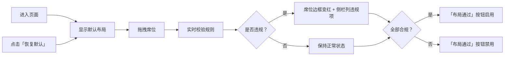

## 1. 产品概述

茶艺师培训室茶席席位布局合规预览屏，供学员在固定矩形茶席面内摆放6把席位，实时校验布局合规性。

- 主要用途：茶艺师培训教学工具，帮助学员掌握规范的茶席席位摆放
- 目标用户：茶艺培训学员、讲师
- 产品价值：通过可视化拖拽和实时校验，提升茶席布局学习效率

## 2. 核心功能

### 2.1 用户角色

| 角色 | 注册方式 | 核心权限 |
|------|----------|----------|
| 学员 | 无需注册 | 拖拽席位、查看违规提示、恢复默认布局 |

### 2.2 功能模块

1. **茶席画布模块**：800×500 固定区域，支持席位拖拽
2. **席位组件模块**：6 把可拖拽席位（编号 1–6），每把 40×40
3. **规则校验模块**：实时校验距离、边界、主泡区规则
4. **违规提示模块**：违规席位边框变红，侧栏列出违规详情
5. **布局控制模块**：一键恢复默认排列、布局通过按钮

### 2.3 页面详情

| 页面名称 | 模块名称 | 功能描述 |
|----------|----------|----------|
| 主页面 | 茶席画布 | 800×500 茶席区域，显示主泡区标记（上边 80px 内） |
| 主页面 | 席位组件 | 6 把可拖拽席位，支持鼠标拖拽定位 |
| 主页面 | 违规侧栏 | 实时显示所有违规项（席位号 + 原因） |
| 主页面 | 控制按钮 | 「恢复默认布局」按钮、「布局通过」按钮（全部合规才可点击） |

## 3. 核心流程

用户进入页面 → 查看默认席位排列 → 拖拽席位调整位置 → 系统实时校验规则 → 违规席位变红且侧栏显示原因 → 全部合规后「布局通过」按钮可点击 → 点击「恢复默认」可重置排列

## 4. 用户界面设计

### 4.1 设计风格

- 主色调：深茶色 `#5D4037`、米白 `#F5F0E6`、竹青 `#8BC34A`
- 违规色：警示红 `#E53935`
- 按钮风格：圆角矩形，悬停有阴影反馈
- 字体：标题用「思源宋体」，正文用「思源黑体」
- 布局风格：左侧茶席画布（800×500），右侧控制与违规侧栏
- 视觉细节：茶席背景添加 subtle 竹纹纹理，席位为圆形设计

### 4.2 页面设计概述

| 页面名称 | 模块名称 | UI 元素 |
|----------|----------|----------|
| 主页面 | 茶席画布 | 800×500 米白色区域，顶部 80px 区域用虚线标记为主泡区，竹纹背景 |
| 主页面 | 席位组件 | 圆形席位，显示编号，正常时深茶色边框，违规时红色边框 |
| 主页面 | 违规侧栏 | 固定宽度侧栏，标题「违规清单」，列表显示违规项 |
| 主页面 | 控制按钮 | 底部按钮区，「恢复默认布局」次要按钮，「布局通过」主要按钮 |

### 4.3 响应性

- 桌面端优先，固定布局设计
- 最小支持分辨率：1280×768
- 侧栏固定宽度 280px，茶席区域居中显示

### 4.4 交互反馈

- 拖拽时席位半透明显示
- 释放时平滑过渡动画
- 违规状态变化时有边框颜色过渡动画
- 按钮悬停有缩放和阴影效果
