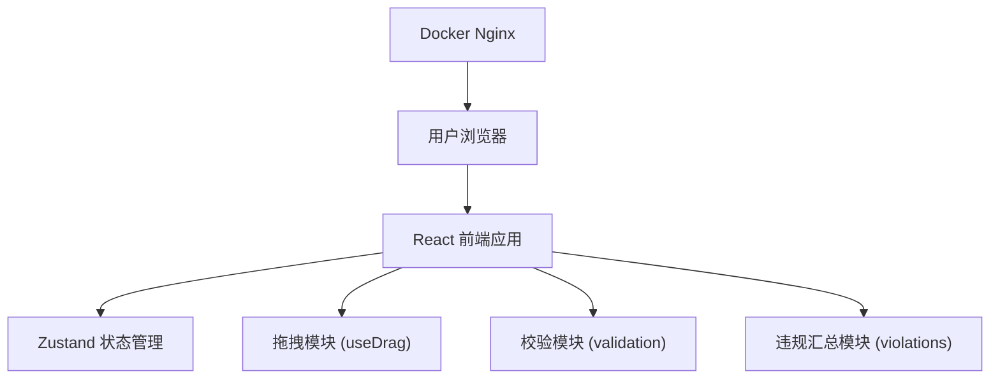

## 1. 架构设计



## 2. 技术描述

- **前端**：React@18 + TypeScript + Vite + TailwindCSS@3 + Zustand
- **初始化工具**：vite-init
- **后端**：无（纯静态前端应用）
- **部署**：Docker + Nginx 静态托管

## 3. 核心模块划分

| 模块 | 文件路径 | 职责 |
|------|----------|------|
| 拖拽定位 | `src/hooks/useDrag.ts` | 处理席位拖拽逻辑，坐标计算 |
| 距离校验 | `src/utils/distanceValidation.ts` | 校验席位之间的中心距离 |
| 边界校验 | `src/utils/boundaryValidation.ts` | 校验席位是否超出茶席边界 |
| 主泡区校验 | `src/utils/mainAreaValidation.ts` | 校验1号席是否在主泡区内 |
| 违规汇总 | `src/utils/violationSummary.ts` | 汇总所有违规项，生成违规列表 |
| 状态管理 | `src/store/useTeaMatStore.ts` | 管理席位位置、违规状态等全局状态 |
| 茶席画布 | `src/components/TeaMat.tsx` | 800×500 茶席区域组件 |
| 席位组件 | `src/components/Seat.tsx` | 单个席位组件，支持拖拽 |
| 违规侧栏 | `src/components/ViolationSidebar.tsx` | 显示违规清单 |
| 控制按钮 | `src/components/ControlPanel.tsx` | 恢复默认、布局通过按钮 |
| 默认布局 | `src/utils/defaultLayout.ts` | 6 个席位的默认坐标配置 |

## 4. 数据模型定义

### 4.1 席位数据结构

```typescript
interface Seat {
  id: number;          // 席位编号 1-6
  x: number;           // 左上角 x 坐标
  y: number;           // 左上角 y 坐标
  width: number;       // 固定 40
  height: number;      // 固定 40
}

interface Violation {
  seatId: number;      // 违规席位编号
  reason: string;      // 违规原因描述
  type: 'distance' | 'boundary' | 'mainArea';
}

interface TeaMatState {
  seats: Seat[];
  violations: Violation[];
  isAllCompliant: boolean;
  setSeatPosition: (id: number, x: number, y: number) => void;
  resetToDefault: () => void;
  validateAll: () => void;
}
```

### 4.2 常量定义

```typescript
// 茶席尺寸
const TEA_MAT_WIDTH = 800;
const TEA_MAT_HEIGHT = 500;

// 席位尺寸
const SEAT_SIZE = 40;

// 校验规则
const MIN_CENTER_DISTANCE = 120;  // 最小中心距离
const MAIN_AREA_MAX_TOP = 80;     // 主泡区距上边最大距离
const MAIN_SEAT_ID = 1;           // 主泡席编号
```

### 4.3 默认布局坐标

```typescript
const DEFAULT_SEATS: Seat[] = [
  { id: 1, x: 380, y: 40, width: 40, height: 40 },   // 主泡，顶部居中
  { id: 2, x: 140, y: 180, width: 40, height: 40 },  // 左侧上
  { id: 3, x: 140, y: 340, width: 40, height: 40 },  // 左侧下
  { id: 4, x: 620, y: 180, width: 40, height: 40 },  // 右侧上
  { id: 5, x: 620, y: 340, width: 40, height: 40 },  // 右侧下
  { id: 6, x: 380, y: 260, width: 40, height: 40 },  // 底部居中
];
```

## 5. 校验逻辑

### 5.1 中心距离校验

对于每对席位 (i, j)，计算中心点距离：
```
centerX = x + width / 2
centerY = y + height / 2
distance = sqrt((centerXi - centerXj)² + (centerYi - centerYj)²)
```
若 `distance < 120`，则两个席位都违规。

### 5.2 边界校验

席位需满足：
```
x >= 0 && x + width <= TEA_MAT_WIDTH
y >= 0 && y + height <= TEA_MAT_HEIGHT
```

### 5.3 主泡区校验

1 号席需满足：
```
y <= MAIN_AREA_MAX_TOP
```

## 6. Docker 部署配置

使用 Nginx 静态托管，Dockerfile 配置：
- 构建阶段：使用 Node 镜像执行 `npm run build`
- 运行阶段：使用 Nginx 镜像，将 dist 目录复制到 `/usr/share/nginx/html`
- 暴露 80 端口
